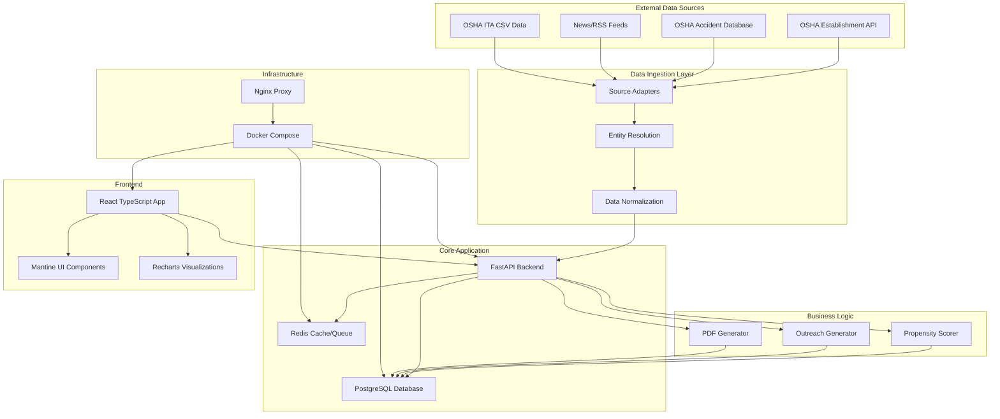

# RiskRadar Architecture

## System Overview

RiskRadar is a modern web application built with a microservices-inspired architecture that processes public safety data to identify business development opportunities in the construction industry.



## Component Architecture

### 1. Data Ingestion Layer

#### Source Adapters (`/backend/connectors/`)
- **Purpose**: Modular connectors for different data sources
- **Pattern**: Common base interface with source-specific implementations
- **Features**: Rate limiting, error handling, data normalization

```python
class BaseAdapter(ABC):
    @abstractmethod
    async def pull(self, since, until, companies, projects) -> List[NormalizedEvent]:
        pass
```

**Implemented Adapters**:
- `MockOshaEstablishmentAdapter`: OSHA establishment inspections (mock)
- `MockOshaAccidentAdapter`: OSHA accident investigations (mock)  
- `MockNewsAdapter`: RSS news feeds (mock)
- `ITAAdapter`: OSHA Injury Tracking Application data

#### Entity Resolution (`/backend/entity_resolution.py`)
- **Purpose**: Company name normalization and relationship mapping
- **Features**: Fuzzy matching, alias management, confidence scoring
- **Algorithm**: RapidFuzz for string similarity, configurable thresholds

### 2. Core Backend (`/backend/`)

#### FastAPI Application (`main.py`)
- **Framework**: FastAPI with automatic OpenAPI documentation
- **Features**: CORS middleware, dependency injection, async support
- **Endpoints**: RESTful API following OpenAPI 3.0 specification

#### Database Layer (`models.py`, `database.py`)
- **ORM**: SQLModel (Pydantic + SQLAlchemy)
- **Database**: PostgreSQL 15 with JSON support
- **Features**: Automatic migrations, relationship mapping, indexing

**Key Models**:
```python
Company -> CompanyAlias (1:N)
Company -> Event (1:N)  
Project -> SubRelationship (1:N)
Event -> TargetOpportunity (1:N)
TargetOpportunity -> OutreachKit (1:N)
```

### 3. Business Logic Layer

#### Propensity Scoring (`/backend/scoring/`)
- **Purpose**: Calculate opportunity scores based on incident data
- **Methodology**: Weighted scoring across 7 factors (0-100 scale)
- **Configuration**: YAML-based benchmarks and weights

**Scoring Factors**:
1. **Recency (30%)**: Exponential decay over 180 days
2. **Severity (25%)**: Incident impact assessment
3. **Frequency (15%)**: Pattern recognition over 24 months
4. **ITA Metrics (15%)**: DART rate vs industry benchmarks
5. **Trade Risk (5%)**: High-risk activity identification
6. **Relationship Certainty (5%)**: GC-sub connection confidence
7. **News Coverage (5%)**: Media attention analysis

#### Outreach Generation (`/backend/outreach_generator.py`)
- **Purpose**: Generate empathetic, consultative messaging
- **Templates**: Email, LinkedIn DM, call scripts
- **Approach**: Context-aware, non-sensational communication

#### PDF Export (`/backend/pdf_generator.py`)
- **Library**: ReportLab for PDF generation
- **Features**: Professional formatting, charts, branded layout
- **Content**: Executive summary, timelines, benchmarks, recommendations

### 4. Frontend Architecture (`/frontend/`)

#### React Application Structure
```
src/
├── components/     # Reusable UI components
├── pages/          # Route-level components  
├── utils/          # API client and utilities
├── types/          # TypeScript definitions
└── hooks/          # Custom React hooks
```

#### Technology Stack
- **Framework**: React 18 with TypeScript
- **Build Tool**: Vite for fast development
- **UI Library**: Mantine for professional components
- **Charts**: Recharts for data visualizations
- **Routing**: React Router v6
- **State**: React hooks (no external state management)

#### Key Components
- **Dashboard**: Real-time metrics and trend visualization
- **TargetList**: Sortable, filterable opportunity table
- **TargetDetail**: Deep-dive analysis with timeline
- **OutreachKit**: Generated content with copy functionality
- **Admin**: Data ingestion and file upload interface

### 5. Data Flow Architecture

#### Ingestion Pipeline
```
External Sources → Adapters → Normalization → Database
                                    ↓
Company Resolution ← Entity Resolver ← Raw Events
                                    ↓
Relationship Mapping → Scoring Engine → Opportunities
                                    ↓
Outreach Generator → PDF Generator → Sales Assets
```

#### Real-time Processing
1. **Ingestion Trigger**: Manual or scheduled data pulls
2. **Event Processing**: Normalize and store incident data
3. **Entity Resolution**: Link incidents to companies/projects
4. **Scoring**: Calculate propensity scores for opportunities
5. **Generation**: Create outreach materials on-demand

### 6. Infrastructure Layer

#### Development Environment (`docker-compose.yml`)
```yaml
Services:
  - postgres: Primary database
  - redis: Caching and task queue
  - api: FastAPI backend
  - web: React frontend  
  - worker: Background task processing
```

#### Production Considerations
- **Load Balancing**: Nginx reverse proxy
- **Database**: Connection pooling, read replicas
- **Caching**: Redis for frequently accessed data
- **Background Jobs**: Celery with Redis broker
- **Monitoring**: Health checks and logging

## Security Architecture

### Data Protection
- **Public Data Only**: No private/confidential information
- **Rate Limiting**: Respectful external API usage
- **Input Validation**: SQLModel/Pydantic validation
- **SQL Injection**: ORM-based queries only

### Access Control
- **Internal Use**: Designed for internal teams only
- **Session Management**: Cookie-based authentication
- **CORS**: Configured for specific origins
- **API Documentation**: Public within organization

## Performance Considerations

### Database Optimization
- **Indexing**: Strategic indexes on query columns
- **JSON Storage**: Flexible event data storage
- **Query Patterns**: Optimized for dashboard and filtering
- **Connection Pooling**: Efficient database connections

### Caching Strategy
- **Redis**: Session data and frequently accessed data
- **HTTP Caching**: Static assets and API responses
- **Query Caching**: Expensive aggregation queries

### Scalability Planning
- **Horizontal Scaling**: Stateless API design
- **Database Scaling**: Read replica support
- **Background Processing**: Async task queuing
- **CDN Ready**: Static asset optimization

## Monitoring & Observability

### Logging Strategy
- **Structured Logging**: JSON format with correlation IDs
- **Log Levels**: Debug, Info, Warning, Error
- **Audit Trail**: User actions and data changes
- **Performance Metrics**: Response times and throughput

### Health Monitoring
- **Health Endpoints**: `/health` for service status
- **Database Checks**: Connection and query health
- **External Dependencies**: Source availability monitoring
- **Resource Usage**: Memory and CPU monitoring

## Development Workflow

### Local Development
1. **Environment Setup**: Docker Compose for all services
2. **Hot Reload**: Backend and frontend auto-reload
3. **Database Seeding**: Sample data for development
4. **API Documentation**: Interactive Swagger UI

### Testing Strategy
- **Unit Tests**: Core business logic testing
- **Integration Tests**: API endpoint testing
- **E2E Tests**: Critical user flow validation
- **Mock Data**: Realistic test fixtures

### Deployment Pipeline
1. **Code Quality**: Linting and formatting checks
2. **Testing**: Automated test suite execution
3. **Build**: Container image creation
4. **Deploy**: Staged deployment with rollback capability

This architecture provides a solid foundation for the RiskRadar application while maintaining flexibility for future enhancements and scaling requirements.