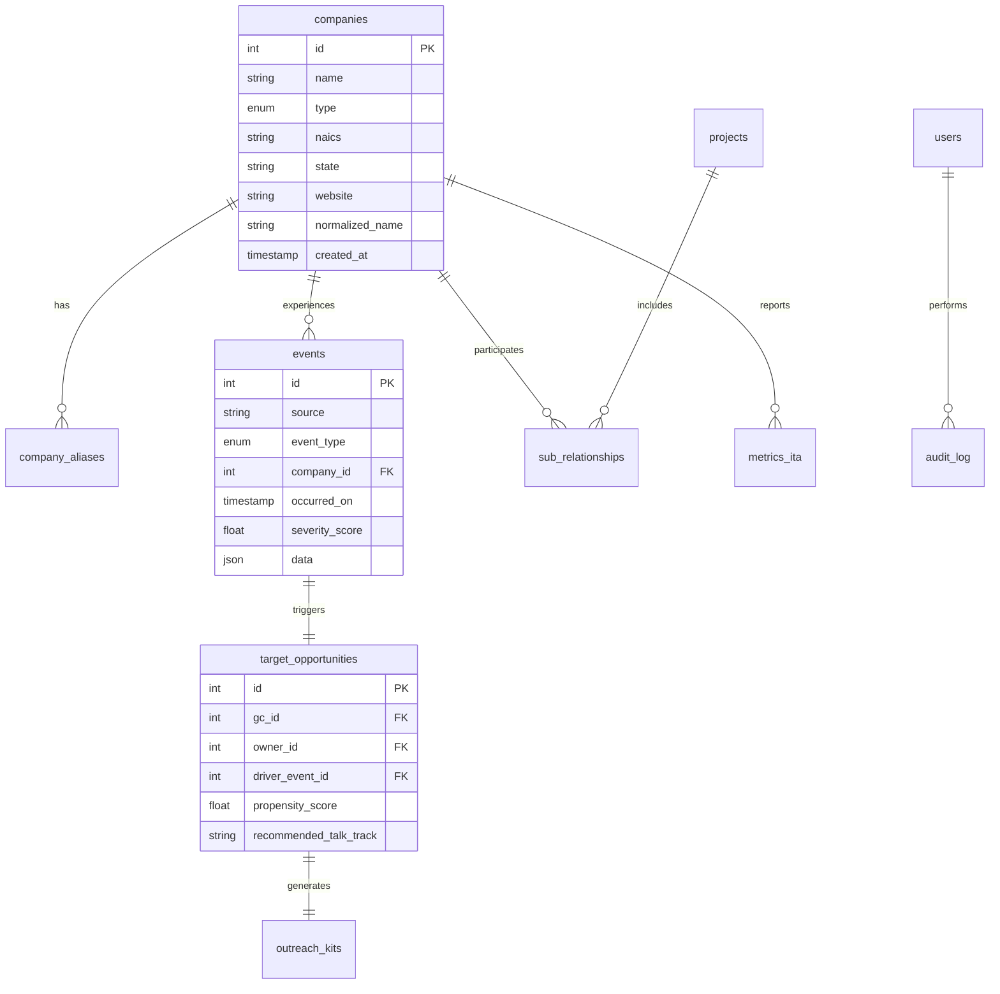

# RiskRadar Data Dictionary

## Database Schema Overview

This document describes all database tables, columns, relationships, and data types used in the RiskRadar application.

## Core Tables

### companies
Primary entity table for all construction companies (GCs, owners, subcontractors).

| Column | Type | Constraints | Description |
|--------|------|-------------|-------------|
| id | INTEGER | PRIMARY KEY, AUTO_INCREMENT | Unique company identifier |
| name | VARCHAR(255) | NOT NULL, INDEX | Official company name |
| type | ENUM | NOT NULL, INDEX | Company type: 'GC', 'Owner', 'Sub', 'Unknown' |
| naics | VARCHAR(10) | NULLABLE | North American Industry Classification System code |
| state | VARCHAR(2) | NULLABLE, INDEX | US state abbreviation |
| website | VARCHAR(255) | NULLABLE | Company website URL |
| normalized_name | VARCHAR(255) | NOT NULL, INDEX | Cleaned name for matching |
| created_at | TIMESTAMP | DEFAULT NOW() | Record creation timestamp |

**Indexes:**
- `ix_companies_name` (name)
- `ix_companies_type` (type)
- `ix_companies_state` (state)
- `ix_companies_normalized_name` (normalized_name)

### company_aliases
Alternative names and variations for companies to improve entity resolution.

| Column | Type | Constraints | Description |
|--------|------|-------------|-------------|
| id | INTEGER | PRIMARY KEY, AUTO_INCREMENT | Unique alias identifier |
| company_id | INTEGER | FOREIGN KEY (companies.id), INDEX | Reference to parent company |
| alias | VARCHAR(255) | NOT NULL, INDEX | Alternative company name |
| confidence | FLOAT | DEFAULT 1.0 | Matching confidence (0.0-1.0) |

**Foreign Keys:**
- `company_id` → `companies.id` (CASCADE DELETE)

### projects
Construction projects linking owners, GCs, and subcontractors.

| Column | Type | Constraints | Description |
|--------|------|-------------|-------------|
| id | INTEGER | PRIMARY KEY, AUTO_INCREMENT | Unique project identifier |
| name | VARCHAR(255) | NOT NULL, INDEX | Project name |
| location | VARCHAR(255) | NULLABLE | Project location/address |
| owner_id | INTEGER | FOREIGN KEY (companies.id), NULLABLE | Project owner company |
| gc_id | INTEGER | FOREIGN KEY (companies.id), NULLABLE | General contractor company |
| start_date | DATE | NULLABLE | Project start date |
| end_date | DATE | NULLABLE | Project completion date |

**Foreign Keys:**
- `owner_id` → `companies.id` (SET NULL)
- `gc_id` → `companies.id` (SET NULL)

### sub_relationships
Relationships between subcontractors, GCs, owners, and projects.

| Column | Type | Constraints | Description |
|--------|------|-------------|-------------|
| id | INTEGER | PRIMARY KEY, AUTO_INCREMENT | Unique relationship identifier |
| gc_id | INTEGER | FOREIGN KEY (companies.id), NULLABLE | General contractor |
| owner_id | INTEGER | FOREIGN KEY (companies.id), NULLABLE | Project owner |
| sub_id | INTEGER | FOREIGN KEY (companies.id), NOT NULL | Subcontractor |
| project_id | INTEGER | FOREIGN KEY (projects.id), NULLABLE | Related project |
| trade | VARCHAR(100) | NULLABLE | Trade/specialty (e.g., "Roofing", "Steel") |
| po_value | DECIMAL(12,2) | NULLABLE | Purchase order value |
| start_date | DATE | NULLABLE | Subcontract start date |
| end_date | DATE | NULLABLE | Subcontract end date |

**Foreign Keys:**
- `gc_id` → `companies.id` (SET NULL)
- `owner_id` → `companies.id` (SET NULL)  
- `sub_id` → `companies.id` (CASCADE DELETE)
- `project_id` → `projects.id` (SET NULL)

### events
Safety incidents, inspections, citations, and other risk events.

| Column | Type | Constraints | Description |
|--------|------|-------------|-------------|
| id | INTEGER | PRIMARY KEY, AUTO_INCREMENT | Unique event identifier |
| source | VARCHAR(50) | NOT NULL, INDEX | Data source (e.g., "osha_establishment") |
| event_type | ENUM | NOT NULL, INDEX | Event type: 'inspection', 'citation', 'accident', 'news', 'ita' |
| company_id | INTEGER | FOREIGN KEY (companies.id), INDEX | Related company |
| project_id | INTEGER | FOREIGN KEY (projects.id), NULLABLE | Related project (if applicable) |
| occurred_on | TIMESTAMP | NOT NULL, INDEX | When the event occurred |
| severity_score | FLOAT | DEFAULT 0.0 | Calculated severity score (0-100) |
| data | JSON | NOT NULL | Event-specific data (violations, narrative, etc.) |
| link | VARCHAR(500) | NULLABLE | URL to official record |
| created_at | TIMESTAMP | DEFAULT NOW() | Record creation timestamp |

**Foreign Keys:**
- `company_id` → `companies.id` (CASCADE DELETE)
- `project_id` → `projects.id` (SET NULL)

**Indexes:**
- `ix_events_source` (source)
- `ix_events_event_type` (event_type)
- `ix_events_company_id` (company_id)
- `ix_events_occurred_on` (occurred_on)

### metrics_ita
OSHA Injury Tracking Application (ITA) annual safety metrics.

| Column | Type | Constraints | Description |
|--------|------|-------------|-------------|
| id | INTEGER | PRIMARY KEY, AUTO_INCREMENT | Unique metric identifier |
| sub_id | INTEGER | FOREIGN KEY (companies.id), INDEX | Subcontractor company |
| year | INTEGER | NOT NULL, INDEX | Reporting year |
| recordables | INTEGER | NULLABLE | Total recordable cases |
| darts | INTEGER | NULLABLE | Days Away, Restricted, Transfer cases |
| hours_worked | INTEGER | NULLABLE | Total hours worked |
| dart_rate | FLOAT | NULLABLE | DART rate per 200,000 hours |
| source_link | VARCHAR(500) | NULLABLE | Link to OSHA ITA data |

**Foreign Keys:**
- `sub_id` → `companies.id` (CASCADE DELETE)

**Indexes:**
- `ix_metrics_ita_sub_id` (sub_id)
- `ix_metrics_ita_year` (year)
- `unique_sub_year` (sub_id, year) - UNIQUE

## Business Logic Tables

### target_opportunities
High-propensity opportunities generated by the scoring engine.

| Column | Type | Constraints | Description |
|--------|------|-------------|-------------|
| id | INTEGER | PRIMARY KEY, AUTO_INCREMENT | Unique opportunity identifier |
| gc_id | INTEGER | FOREIGN KEY (companies.id), NULLABLE | Target general contractor |
| owner_id | INTEGER | FOREIGN KEY (companies.id), NULLABLE | Target owner/developer |
| driver_event_id | INTEGER | FOREIGN KEY (events.id), NOT NULL | Triggering event |
| propensity_score | FLOAT | NOT NULL, INDEX | Calculated propensity score (0-100) |
| confidence | FLOAT | DEFAULT 0.0 | Relationship confidence (0.0-1.0) |
| recommended_talk_track | TEXT | NOT NULL | Suggested approach strategy |
| created_at | TIMESTAMP | DEFAULT NOW() | Record creation timestamp |

**Foreign Keys:**
- `gc_id` → `companies.id` (SET NULL)
- `owner_id` → `companies.id` (SET NULL)
- `driver_event_id` → `events.id` (CASCADE DELETE)

**Indexes:**
- `ix_target_opportunities_propensity_score` (propensity_score DESC)
- `ix_target_opportunities_created_at` (created_at DESC)

**Constraints:**
- CHECK: At least one of `gc_id` or `owner_id` must be NOT NULL

### outreach_kits
Generated sales outreach materials (emails, LinkedIn messages, call scripts).

| Column | Type | Constraints | Description |
|--------|------|-------------|-------------|
| id | INTEGER | PRIMARY KEY, AUTO_INCREMENT | Unique kit identifier |
| target_id | INTEGER | FOREIGN KEY (target_opportunities.id), INDEX | Related opportunity |
| email_md | TEXT | NOT NULL | Email template (Markdown) |
| linkedin_md | TEXT | NOT NULL | LinkedIn DM template (Markdown) |
| call_notes_md | TEXT | NOT NULL | Call script and notes (Markdown) |
| attachments | JSON | DEFAULT {} | Additional materials metadata |
| created_at | TIMESTAMP | DEFAULT NOW() | Record creation timestamp |

**Foreign Keys:**
- `target_id` → `target_opportunities.id` (CASCADE DELETE)

## System Tables

### users
Application users (for future authentication implementation).

| Column | Type | Constraints | Description |
|--------|------|-------------|-------------|
| id | INTEGER | PRIMARY KEY, AUTO_INCREMENT | Unique user identifier |
| email | VARCHAR(255) | UNIQUE, NOT NULL | User email address |
| name | VARCHAR(255) | NOT NULL | User display name |
| role | VARCHAR(50) | DEFAULT 'user' | User role (user, admin) |
| hashed_password | VARCHAR(255) | NULLABLE | Password hash (future use) |
| created_at | TIMESTAMP | DEFAULT NOW() | Record creation timestamp |

### audit_log
System activity and data change tracking.

| Column | Type | Constraints | Description |
|--------|------|-------------|-------------|
| id | INTEGER | PRIMARY KEY, AUTO_INCREMENT | Unique log identifier |
| action | VARCHAR(100) | NOT NULL, INDEX | Action performed |
| user_id | INTEGER | FOREIGN KEY (users.id), NULLABLE | User who performed action |
| payload | JSON | DEFAULT {} | Action details and context |
| created_at | TIMESTAMP | DEFAULT NOW(), INDEX | Action timestamp |

**Foreign Keys:**
- `user_id` → `users.id` (SET NULL)

## Data Types and Enums

### CompanyType Enum
- `GC`: General Contractor
- `Owner`: Owner/Developer
- `Sub`: Subcontractor
- `Unknown`: Unclassified

### EventType Enum
- `inspection`: OSHA inspection
- `citation`: OSHA citation/violation
- `accident`: Workplace accident/incident
- `news`: Media coverage/news article
- `ita`: ITA safety metrics

## JSON Data Structures

### events.data Field
Structure varies by `event_type`:

#### inspection/citation events:
```json
{
  "violations": 3,
  "penalty": 25000,
  "naics": "236220",
  "state": "TX",
  "severity_type": "Serious",
  "raw_company_name": "ABC Construction LLC"
}
```

#### accident events:
```json
{
  "narrative": "Employee fell from scaffolding...",
  "fatality": false,
  "catastrophe": false,
  "keywords": ["fall", "scaffolding", "safety harness"],
  "raw_company_name": "ABC Construction LLC"
}
```

#### news events:
```json
{
  "title": "Construction Site Accident Shuts Down Project",
  "summary": "Work halted after incident...",
  "keywords": ["accident", "construction", "shutdown"],
  "all_mentions": ["ABC Construction LLC", "MegaBuild Corp"],
  "raw_company_name": "ABC Construction LLC"
}
```

#### ita events:
```json
{
  "year": 2023,
  "naics": "236220",
  "state": "TX",
  "recordables": 8,
  "darts": 4,
  "hours_worked": 125000,
  "dart_rate": 6.4,
  "raw_company_name": "ABC Construction LLC"
}
```

### outreach_kits.attachments Field
```json
{
  "context": {
    "company_name": "MegaBuild Construction Corp",
    "incident_type": "OSHA inspection with violations",
    "propensity_score": 81.5,
    "talk_track": "Post-incident stabilization & future prequal"
  },
  "generated_at": "2024-01-15T10:30:00Z",
  "template_version": "1.0"
}
```

## Relationships Diagram



## Data Constraints and Business Rules

### Data Quality Rules
1. **Company Names**: Must be non-empty, trimmed strings
2. **Normalized Names**: Automatically generated, uppercase, no punctuation
3. **Propensity Scores**: Range 0-100, calculated not manually entered
4. **Confidence Scores**: Range 0.0-1.0 for all confidence fields
5. **DART Rates**: Must be non-negative when present

### Referential Integrity
1. **Cascade Deletes**: Events cascade when companies are deleted
2. **Soft References**: Projects and opportunities use SET NULL for company references
3. **Required Relationships**: Target opportunities must have either GC or Owner
4. **Audit Trail**: All modifications logged to audit_log table

### Performance Considerations
1. **Indexes**: Optimized for dashboard queries and filtering
2. **JSON Storage**: Event data stored as JSON for flexibility
3. **Query Patterns**: Designed for time-series and aggregation queries
4. **Partitioning**: Consider partitioning events table by date for large datasets

This data dictionary serves as the authoritative reference for RiskRadar's database schema and should be updated when schema changes are made.